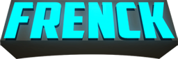
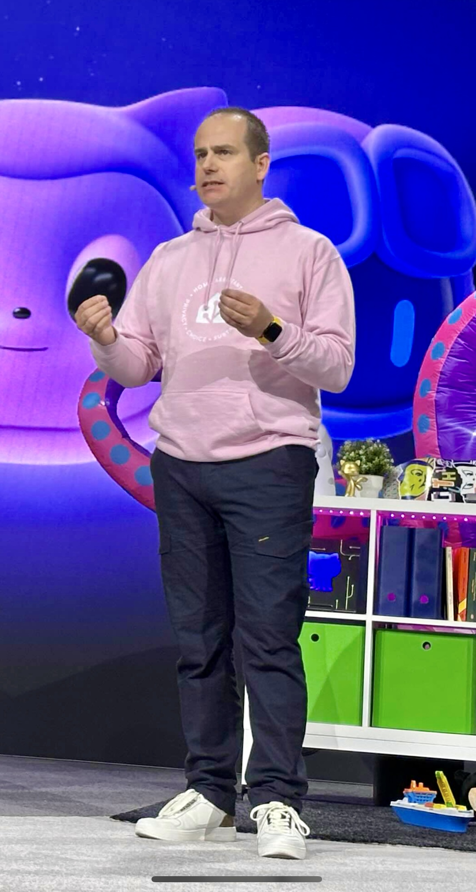

<h1 align="center">
     
    
</h1>

Oh! Hi there :wave:

I'm Franck Nijhof, better known as Frenck, and I'm privileged being able to work on open source software full-time. This makes GitHub basically my second home. :sweat_smile: :wink:

I'm one of the maintainers and lead engineer of [Home Assistant](https://www.home-assistant.io), an open source home automation platform used by over a million households. As one of the most active open-source projects on GitHub, Home Assistant thrives on community-driven, sustainable development. I love empowering contributors to bring their ideas to life, and in 2024 alone, we have supported over 21,000 people in making their contributions.

Beyond writing code, I enjoy speaking at events, visiting schools, and appearing on podcasts. Sharing knowledge, mentoring newcomers, and exchanging ideas with fellow developers keeps me inspired. 

I'm 42 years old (yes, the answer to the ultimate question of life, the universe, and everything) and live in [Enschede :round_pushpin: The Netherlands](https://earth.google.com/web/c/ChA6DhIIL20vMHBzNHAYASgC) :netherlands: with the love of my life :heart: and my two kids :boy: :girl:; a proud father, working hard to balance family life with my passion for open source, always guided by my personal motto:

> _**Make a positive difference every single day: Be the change.**_

Feel free to reach out to me on any platform you prefer, I love to talk :handshake:

../Frenck

### 📫 Find me on social media

 

    
    &nbsp;&nbsp;&nbsp;
    
    &nbsp;&nbsp;&nbsp;
    
    &nbsp;&nbsp;&nbsp;
    
    &nbsp;&nbsp;&nbsp;
    
    &nbsp;&nbsp;&nbsp;
    
    &nbsp;&nbsp;&nbsp;
    
    &nbsp;&nbsp;&nbsp;
    
    &nbsp;&nbsp;&nbsp;
    
    &nbsp;&nbsp;&nbsp;
    
    &nbsp;&nbsp;&nbsp;
    
    &nbsp;&nbsp;&nbsp;
    

My personal website/blog: <a href="https://frenck.dev">https://frenck.dev</a> 
<i>(Yeah I known... I don't blog enough 😥)</i>

### :star2: GitHub Stats

    
    

### :trophy: GitHub Throphies

    

